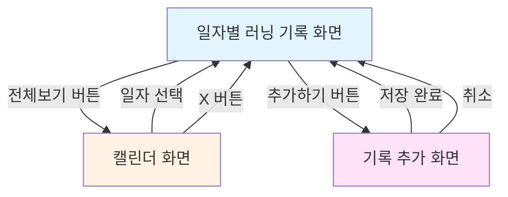

# Running Diary 🏃‍♀️

Running Diary는 단순한 거리와 페이스 기록을 넘어, 러닝 당시의 컨디션과 경험까지 함께 저장하는 러닝 기록 iOS 앱입니다.

## 화면 구성

### 1. 일자별 러닝 기록 화면
- **날짜 캐러셀**: 가로 스크롤 형식으로 날짜 선택 (오늘 기준 전후 2주)
- **러닝 기록 상세 뷰**
  - HealthKit에서 가져온 데이터: 거리, 평균 페이스, 평균 심박수, 평균 케이던스
  - 사용자 입력 데이터: 통증 부위, 주법/스타일, 컨디션 (수면, 식사, 음주, 메모), 신은 신발
  - 러닝 경로 지도
- **"전체보기" 버튼**: 캘린더 화면으로 이동
- **"추가하기" 버튼**: 기록이 없을 때 기록 추가 화면으로 이동

### 2. 캘린더 화면
- **월별 캘린더 UI**: 각 일자마다 러닝 기록 요약 정보 표시
  - Circular progress bar 또는 텍스트로 주요 지표 표기
- **화면 전환**
  - 일자 선택 시 → 해당 일자의 상세 기록 화면으로 이동
  - "X" 버튼 → 일자별 러닝 기록 화면으로 복귀

### 3. 기록 추가 화면
- **HealthKit 연동**: 거리, 페이스, 심박수, 케이던스 자동 불러오기
- **사용자 직접 입력**
  - 통증 부위
  - 주법/스타일
  - 컨디션: 수면, 식사, 음주, 기타 메모
  - 신은 신발
- 일자별 러닝 기록 화면의 "추가하기" 버튼을 통해 진입

## 화면 흐름도

### 화면 간 네비게이션

| 시작 화면 | 액션 | 목적지 화면 | 방식 |
|---------|------|-----------|------|
| 일자별 러닝 기록 | "전체보기" 버튼 클릭 | 캘린더 | Present/Push |
| 일자별 러닝 기록 | "추가하기" 버튼 클릭 | 기록 추가 | Present (Sheet/FullScreen) |
| 캘린더 | 일자 선택 | 일자별 러닝 기록 | Dismiss or Update |
| 캘린더 | "X" 버튼 클릭 | 일자별 러닝 기록 | Dismiss |
| 기록 추가 | 저장 완료 | 일자별 러닝 기록 | Dismiss |
| 기록 추가 | 취소 | 일자별 러닝 기록 | Dismiss |

## 기술 스택

### Architecture
- **Clean Architecture**: 계층 분리를 통한 유지보수성과 테스트 용이성 확보
  - **Domain Layer**: 비즈니스 로직과 Entity 정의
  - **Data Layer**: 데이터 저장소 및 Repository 구현 (추후 구현 예정)
  - **Presentation Layer**: MVVM 패턴 기반 UI 및 상태 관리

### Tech Stack
- **SwiftUI**: 선언적 UI 프레임워크
- **Observation Framework**: `@Observable`을 사용한 반응형 상태 관리
- **Swift Concurrency**: async/await 기반 비동기 처리

## 개발 환경

- **Xcode**: 16.0+
- **iOS Deployment Target**: 26.0
- **Swift**: 5.0
- **Language**: Swift, SwiftUI